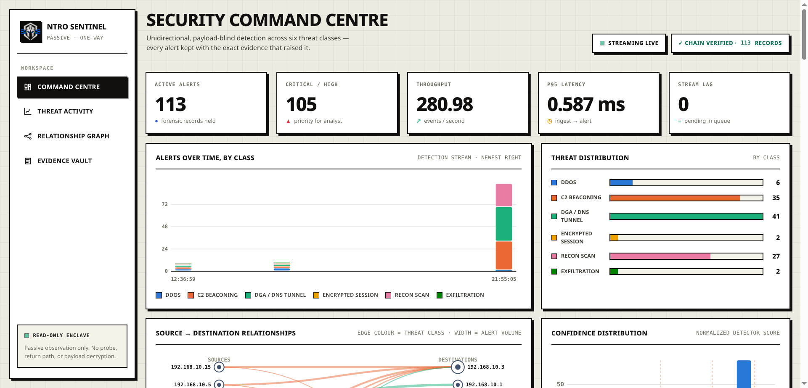
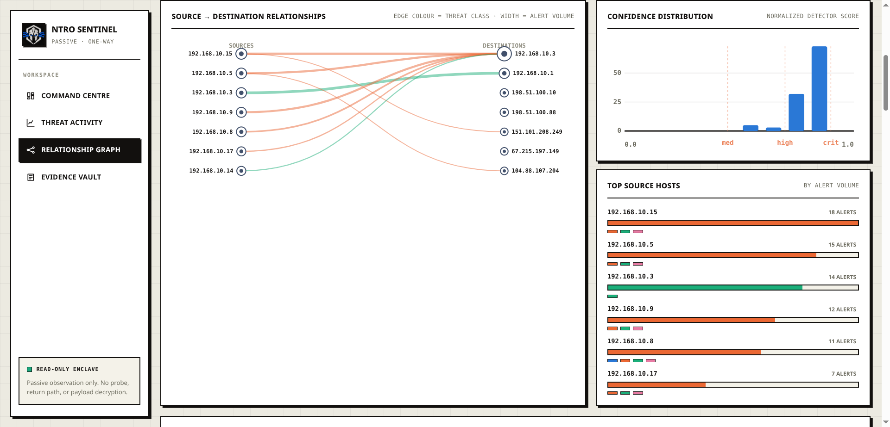
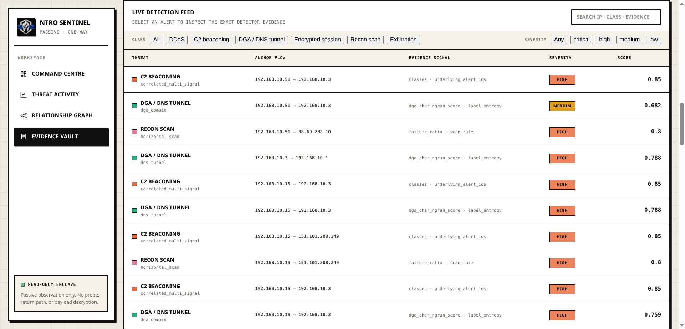

<div align="center">


# NTRO Sentinel

**Passive, payload-blind threat detection for one-way IP traffic.**
Turns a mirrored copy of network *metadata* into explainable alerts, a live analyst dashboard, and tamper-evident forensic records — with no return path, no active probe, no blocking, and no TLS/QUIC decryption.


</div>

---

Sentinel watches a *copy* of traffic and never touches payload bytes. It reads only metadata — IPs, ports, byte counts, timings, DNS query names, TLS fingerprints — runs six deterministic detectors over bounded time windows, correlates alerts per source, hash-chains them into an append-only store, and streams them to a single-file dashboard. It is built to run air-gapped and to survive massive traffic without unbounded memory or an un-scrollable UI.

Three constraints shape every design choice:

- **Payload-blind** — metadata only, never packet contents.
- **One-way** — the sensor can only *receive* a mirror; it never emits onto the monitored link.
- **Honest** — no fabricated metrics. Every number is produced by a committed script or not claimed at all.

## Dashboard

A single-file, zero-dependency, air-gapped analyst console — live KPIs, an explainable detection feed, and per-source relationship forensics. No payload bytes ever reach it.

<div align="center">



<sub><b>Command Centre</b> · live KPIs, the detection stream, and per-class volume — chain-verified, streaming live.</sub>

<br><br>



<sub><b>Relationship graph</b> · source→destination edges coloured by threat class, width = alert volume; confidence distribution and top talkers alongside.</sub>

<br><br>



<sub><b>Evidence vault</b> · every alert with the exact detector evidence that raised it — filterable by class and severity.</sub>

</div>

## Project status

Everything below is built, wired end-to-end, and runnable today:

| Area | State |
|---|---|
| 6 detectors (ddos · c2 · dga/dns-tunnel · encrypted-malware · recon · exfiltration) | ✅ deterministic, explainable, MITRE-mapped |
| Streaming engine · per-source correlation · per-threat dedup · bounded windows | ✅ |
| Structural gating for C2/exfil (direction, payload size, destination-ASN reputation) | ✅ offline, air-gapped; **ranks** alerts, never suppresses |
| Hash-chained SQLite store + integrity verification | ✅ |
| FastAPI REST + WebSocket · single-file neo-brutalist dashboard | ✅ |
| Offline PCAP→events adapter + **24/7 live-capture / file-ingest service** | ✅ |
| Controlled-scenario evaluation (9/9 attack scenarios detected · benign FPR 0.0) | ✅ committed |
| Hybrid ML enrichment — DGA char-ngram classifier + exfil anomaly (IsolationForest), both optional & graceful | ✅ |
| Docker hardening · one-way proof scripts | ✅ |

Honest gaps (not yet done, by design — measure it or don't claim it):

- Scored **precision/recall/F1 on external labeled PCAPs** needs the Zeek Tier-A replay + dataset label-join.
- **Sustained throughput is ~1,000-1,500 events/s per process**, not the 5,000 eps in the older
  loadtest artifact (that run measured a near-empty pipeline and does not reproduce). The current
  ceiling is an O(n²) timestamp rebuild in the C2 feature extractor. All throughput evidence is
  synthetic/replayed metadata, not sustained PCAP on a real link — see `context.md` §22.6.
- `encrypted_malware` is not exercised on the offline path (no JA3/TLS derived without Zeek).

## Architecture

```
             mirror / TAP (one-way)
                     │
   ┌─────────────────▼─────────────────┐
   │  ingest                            │   Zeek metadata  ── OR ──  scapy PCAP/live adapter
   │  (conn · dns · tls events)         │   (payload-blind, headers + DNS names only)
   └─────────────────┬─────────────────┘
                     │  events
   ┌─────────────────▼─────────────────┐
   │  Pipeline  (engine/stream_consumer)│   bounded feature windows → 6 detectors
   │  route → detect → dedup(30s)       │   → per-source correlation
   └─────────────────┬─────────────────┘
                     │  alerts (single writer)
   ┌─────────────────▼─────────────────┐
   │  hash-chained SQLite  (alertstore) │   record_hash = sha256(prev_hash + record)
   └─────────────────┬─────────────────┘
                     │
   ┌─────────────────▼─────────────────┐
   │  FastAPI REST + WebSocket → dashboard  (live, air-gapped, single file)
   └────────────────────────────────────┘
```

Every stage is **bounded**: feature windows evict by time *and* key count (max 4096), dedup caps alert volume to ≤1 per behavior per 30s, and every dashboard view caps its input and sorts by importance — so a spoofed million-source flood can neither OOM the worker nor make the UI un-scrollable.

### The six threat classes

| Class | Fires when (metadata only) | MITRE |
|---|---|---|
| `ddos` | `syn_count ≥ 20` or (`udp_count ≥ 20` and `unique_sources ≥ 8`); confidence scales with intensity | T1498 |
| `c2_beaconing` | ≥5 sessions, inter-arrival CV ≤ 0.12, persistence ≥ 120s, ≤2 dst ports, **plus** a client-initiated direction, a heartbeat-sized exchange, and a destination network that ranks the alert. Internal destinations on a non-service port raise `lateral_beacon` | T1071.001 / **T1021** |
| `dga_dns_tunnel` | label length ≥ 18 **and** entropy ≥ 3.3, **or** ML DGA score ≥ 0.8 | T1071.004 / T1568.002 |
| `encrypted_malware` | TLS present **and** (out/in byte ratio > 8 **or** suspicious fingerprint) | T1071.001 |
| `recon_scan` | ≥12 unique dst ports (vertical) or ≥12 unique dst hosts (horizontal) | T1046 |
| `exfiltration` | outbound ≥ 500 KB **and** out/in ratio ≥ 5 | T1041 |

Each alert carries exact feature values, a normalized `confidence` (a detector score, **not** a calibrated probability), severity, MITRE tags, and the `model_version` that produced it — so it is auditable field by field. When one source trips ≥2 distinct classes, the correlator raises a single `correlated_multi_signal` incident instead of scattered blips.

## Quickstart

> **Dependencies.** Viewing the dashboard needs Python 3.11+ and nothing else (stdlib only). Ingesting
> a PCAP or live traffic needs `scapy` (`pip install scapy`). The FastAPI/WebSocket API and the Docker
> stack need `pip install -r requirements.txt`. Ingest does **not** import fastapi, so the capture and
> replay paths work with scapy alone.
>
> **ML enrichment (optional).** The DGA and exfiltration detectors take an optional ML second opinion.
> An artifact is loaded only if its **SHA-256 matches the training manifest** *and* it was built under
> the running scikit-learn; otherwise both detectors fall back silently to their deterministic rules.
> It activates automatically in Docker (the image retrains at build). Locally:
> `make model-eval TRAIN_BACKEND=local`, then run ingest with the same `MODEL_DIR`.

### 1 · See the dashboard — zero dependencies, ~30s

```bash
python3 scripts/preview_server.py 8001
# open http://localhost:8001
```

Reads the live `artifacts/sentinel.db` and re-reads `dashboard/index.html` per request, so edits show
up on refresh. Empty store on first run — see step 2 or 3 to put something in it.

`preview_server.py` is a stdlib **development viewer** mirroring the endpoints below — the four GETs
the dashboard uses, plus `/api/metrics`, `/health` and `POST /api/ingest`. `/ws/alerts` is the one
thing it does **not** implement, so the browser logs a 404 for the WebSocket and silently falls back to
its 5-second poll; that is expected. It is single-threaded, so a burst of concurrent fetches can wedge
it — if the page sticks on "Loading", just restart it.

### 2 · Analyze a capture file

```bash
python3 -m ingest.service --file /path/to/capture.pcap --once
```

Writes into the same store the dashboard reads. Huge capture? Cap the parse:

```bash
MAX_PACKETS=300000 python3 -m ingest.service --file big.pcap --once
```

Accepted: `.pcap` `.pcapng` `.cap`, line-JSON `.jsonl`/`.json`/`.log`, and `.csv`.

**CSVs have two very different outcomes, decided by the header:**

| CSV contains | Result |
|---|---|
| a source **and** destination IP column (e.g. `Source IP`, `Destination IP`) | real alerts through the normal pipeline — they appear in **every** live dashboard panel |
| no endpoint columns (e.g. a CICFlowMeter release: 78 flow statistics + `Label`) | **no flow alerts**, and an on-screen *assessment* panel instead |

The second case is deliberate. Every detector groups on per-flow IP and timestamp; without them,
per-flow attribution is impossible and Sentinel will not fabricate it. The upload still returns a
full assessment — flow count, label census, per-port attack concentration, SYN-heavy fraction — so an
endpoint-less file is not thrown away, it just cannot produce attributed alerts. For per-victim alerts
from such a dataset, replay its **PCAP** through Zeek (Tier A) instead.

To print detections without touching the store:
`python3 -m ingest.pcap_to_events <pcap> [max_packets]`.

### 3 · Capture live traffic — run it 24/7

```bash
sudo python3 -m ingest.service --live <iface> --watch artifacts/inbox
```

- `--live <iface>` — sniff continuously (**root / `CAP_NET_RAW` required**); flows finalize into
  events after ~10s idle, mirroring how Zeek closes a connection.
- `--watch artifacts/inbox` — drop a `.pcap`/`.csv`/`.jsonl` in any time; it is ingested and moved to
  `processed/`.

**Pick the interface that actually carries your traffic.** With two NICs on one subnet, the kernel
uses the lower route metric and the other sits idle — the sniffer will then report "capturing" while
seeing almost nothing:

```bash
ip route | head -3                    # which dev carries the default route?
cat /sys/class/net/<iface>/statistics/rx_packets; sleep 3; cat /sys/class/net/<iface>/statistics/rx_packets
```

**Verify it is really capturing.** A raw-socket failure does not stop the process; the `AsyncSniffer`
thread dies quietly. Confirm the event counter is moving instead of trusting the startup message:

```bash
curl -s http://127.0.0.1:8001/api/metrics
```

A single consumer thread is the **only** writer to the store, so the hash chain stays serialized no
matter how many sources feed it. Leave it running; the dashboard updates live.

### 4 · Full stack (Docker — production-shaped)

```bash
echo "SENTINEL_API_TOKEN=$(python3 -c 'import secrets;print(secrets.token_urlsafe(32))')" >> .env
docker compose up -d --build            # redis + streaming worker + hardened API
# open http://localhost:8000
curl localhost:8000/health              # status + chain validity + pipeline metrics
curl localhost:8000/api/evidence/verify # recompute & verify the whole hash chain
```

`POST /api/alerts` and `POST /api/ingest` are **token-gated** and fail **closed**: with no
`SENTINEL_API_TOKEN` set they return `503` rather than accepting unauthenticated writes into the
tamper-evident chain. Reads (dashboard, `/api/alerts`, `/health`, `/ws/alerts`) stay open, because
this is a read-only analyst enclave. The dashboard prompts for the token once on a `401`/`503` and
keeps it in that tab's `sessionStorage`. `.env` is git-ignored; `.env.example` documents the variable.

Containers run `read_only`, `cap_drop: ALL`, `no-new-privileges`, with pinned images and memory/CPU
limits. Rebuild only the API after editing the dashboard: `docker compose up -d --build api`.

### 5 · Confirm it works

```bash
make test          # 137 unit tests
make evaluate      # 9/9 attack scenarios, benign FPR 0.0 -> eval/results.{json,md}
make generate      # regenerate the controlled scenarios (incl. the F-09 lateral + benign-internal pair)
```

To see a real detection rather than trusting the fixtures, scan a documentation-only address
(`192.0.2.0/24`, RFC 5737 — unrouted, so nothing real is touched) while live capture runs:

```bash
nmap -sT -Pn -n -p 1-45 192.0.2.1
sleep 16                                     # let the 10s flow-close flush run
curl -s "http://127.0.0.1:8001/api/alerts?limit=3"
```

Expect `recon_scan/vertical_scan` anchored on `192.0.2.1` (not on an unrelated CDN IP), plus a
`ddos/syn_flood` for the same probe burst. One scan, one alert.

## Evidence & honesty discipline

This is the project's strongest rule, and it's enforced in code:

- **No fabricated numbers.** `PERFORMANCE.md` deliberately commits no figure. The evaluator reports scenario coverage, a confusion matrix, benign false-positive rate, and alert-level precision — and **explicitly refuses** to print flow-level F1, because homogeneous scenarios would make it a lie.
- **Tamper-evident.** Every alert is chained: `record_hash = sha256(prev_hash + canonical_json(record))`. Editing, reordering, or deleting past records breaks verification, surfaced at `/api/evidence/verify` and `/health`.
- **Traceable.** Every alert names the exact rule/model version that produced it and the feature values behind it.

```bash
make test         # 137 unit tests (windows, all six detectors, dedup, correlation, FPR,
                  #  hash-chain tamper detection, write auth, CSV + external-scoring paths)
make evaluate     # controlled coverage + confusion + FPR → eval/results.{json,md}
make loadtest     # in-process throughput envelope → artifacts/loadtest.{json,md}
make check        # compileall + docker compose config  (CI-style gate)
```

## Repo map

```
ingest/       Zeek script + log tailer · pcap_to_events.py (offline adapter) · service.py (24/7 live+file)
features/     bounded feature windows (base.py = WindowState) + per-class extractors
detectors/    rules.py — the six deterministic detectors
correlation/  engine.py — per-source multi-signal correlation
engine/       stream_consumer.py (Pipeline + redis worker + jsonl runner), contracts, validation, metrics
alertstore/   store.py — hash-chained SQLite
api/          main.py — FastAPI REST + WebSocket, serves the dashboard
dashboard/    index.html — the single-file, zero-dependency UI
models/       train / evaluate / inference for the prototype ML models
eval/         run_suite.py · loadtest.py · cic_ids2017_coverage.py · label_join.py
              (all non-inflationary; label_join is the external P/R harness and REFUSES to
               report on a too-thin ground-truth join)
scripts/      replay · live-capture · one-way-proof · demo · preview_server.py
docs/         DATASETS · LIMITATIONS · OPERATIONS · ENCLAVE_HARDENING · mitre_mapping · …
experiments/  datasets.yml (registry) · scenarios.yml (labels)
```

New to the codebase? [`interesting stuff.md`](interesting%20stuff.md) is the full context & decision log — what every stage does and *why*. Honest limits live in [`docs/LIMITATIONS.md`](docs/LIMITATIONS.md); the live-host procedure in [`docs/OPERATIONS.md`](docs/OPERATIONS.md).

<div align="center"><sub>Built for SIH 2026 · Problem Statement 26145 (NTRO) — AI-based detection of cyber threats in unidirectional IP traffic. · <b>Measure it or don't claim it. Stay payload-blind and one-way.</b></sub></div>

